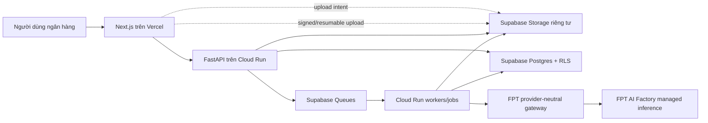
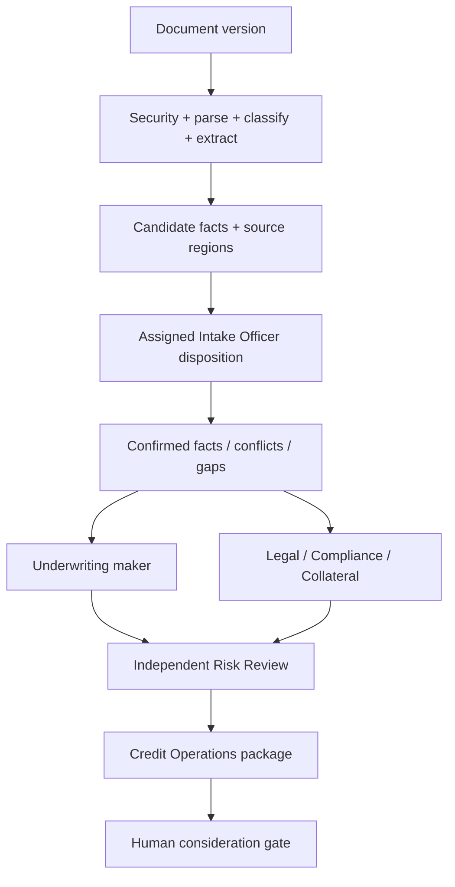

# CreditOpt — SHB CreditOps EvidenceGraph

> Hệ thống multi-agent có khả năng kiểm chứng để hỗ trợ chuẩn bị và rà soát hồ sơ tín dụng vốn lưu động SME/KHDN.

CreditOpt chuyển tài liệu rời rạc thành một **Credit Case Digital Twin** có cấu trúc, version và provenance; điều phối các vai trò AI trong ranh giới xác định; sử dụng công cụ deterministic cho tính toán, rule và state transition; đồng thời giữ toàn bộ quyết định và hành động nhạy cảm dưới quyền kiểm soát của con người.

## Trạng thái dự án

CreditOpt hiện là một **local walking skeleton**, chưa phải hệ thống ngân hàng đã triển khai end-to-end hoặc production-ready.

| Nhãn | Ý nghĩa |
|---|---|
| **Đã triển khai** | Có code và test cục bộ trong repository |
| **Đang hoàn thiện** | Có một phần contract/UI/runtime nhưng luồng end-to-end chưa kín |
| **Thiết kế mục tiêu** | Đã được đặc tả nhưng chưa được triển khai đầy đủ |
| **Câu hỏi mở** | Cần nguồn chính thức, benchmark, quyền truy cập hoặc quyết định quản trị |
| **Ngoài phạm vi hiện tại** | Chỉ được mô phỏng bằng dữ liệu synthetic hoặc chưa được phép thực hiện |

> **Dữ liệu:** All customer data, policies, documents, and banking-system responses in this project are synthetic and created solely for demonstration.

Repository này không chứa chính sách SHB chính thức, không chứng minh tuân thủ pháp lý, không đại diện cho sự phê duyệt của SHB và không cho phép sử dụng dữ liệu khách hàng/ngân hàng thật. Nội dung không phải tư vấn hoặc ý kiến pháp lý; pháp chế/người có thẩm quyền phải xác định văn bản áp dụng từ nguồn chính thức còn hiệu lực.

## 60 giây để hiểu điểm khác biệt

Ba innovations đã có code cục bộ và có thể kiểm tra trực tiếp:

1. **Human-confirmed evidence promotion:** model chỉ tạo candidate; officer disposition mới tạo confirmed fact. Xem [`domain/evidence.py`](services/api/src/creditops/domain/evidence.py) và [confirmed-facts database tests](supabase/tests/confirmed_facts_test.sql).
2. **Deterministic authority firewall:** LLM planner không thể vượt dependency, readiness hoặc human gate. Xem [`orchestration/readiness.py`](services/api/src/creditops/application/orchestration/readiness.py) và [orchestration tests](services/api/tests/api/test_orchestration.py).
3. **Maker–checker có provenance:** Underwriting và Independent Risk dùng artifacts/executions khác nhau; checker cross-check citation và không được tự clear maker output. Xem [`risk_review/analysis.py`](services/api/src/creditops/application/risk_review/analysis.py) và [risk-review API tests](services/api/tests/api/test_risk_review.py).

Graph-guided RAG, structured reasoning inheritance và Digital Twin đủ 14 giai đoạn là **target innovations** đã được đặc tả nhưng chưa triển khai end-to-end.

## Mục lục

- [Bài toán](#bài-toán)
- [Giải pháp](#giải-pháp)
- [Tính năng](#tính-năng)
- [Các điểm đổi mới](#các-điểm-đổi-mới)
- [Đội ngũ agent](#đội-ngũ-agent)
- [Quy trình tín dụng 14 giai đoạn](#quy-trình-tín-dụng-14-giai-đoạn)
- [Kiến trúc](#kiến-trúc)
- [Công nghệ](#công-nghệ)
- [Cấu trúc repository](#cấu-trúc-repository)
- [Chạy local](#chạy-local)
- [Kiểm thử](#kiểm-thử)
- [Triển khai](#triển-khai)
- [Responsible AI và bảo mật](#responsible-ai-và-bảo-mật)
- [Roadmap](#roadmap)
- [Tài liệu](#tài-liệu)

## Bài toán

Quy trình cấp tín dụng doanh nghiệp cần tổng hợp nhiều nhóm tài liệu, đối chiếu dữ liệu, thực hiện tính toán, phân tích chuyên môn, quản lý phiên bản và duy trì separation of duties giữa đơn vị chuẩn bị hồ sơ, thẩm định độc lập, tác nghiệp và cấp có thẩm quyền.

Một chatbot thông thường không giải quyết được các yêu cầu cốt lõi:

- lịch sử hội thoại không phải nguồn dữ liệu có thẩm quyền;
- câu trả lời khó truy ngược đến đúng tài liệu, trang và vùng nguồn;
- model có thể tự suy diễn dữ liệu thiếu hoặc thực hiện sai phép tính;
- một agent duy nhất dễ tự tạo rồi tự xác nhận kết luận của chính mình;
- retry, version mới và xử lý song song có thể tạo duplicate hoặc stale output;
- khuyến nghị AI dễ bị hiểu nhầm thành quyết định tín dụng;
- vector search rộng có thể lấy đúng ngữ nghĩa nhưng sai hồ sơ, sai version hoặc sai policy scope.

## Giải pháp

CreditOpt xây dựng một control plane cho credit operations, trong đó:

1. Tài liệu được upload theo từng document version bất biến.
2. Pipeline an toàn parse, phân loại và tạo candidate facts gắn source region.
3. Cán bộ tiếp nhận disposition từng candidate trước khi dữ liệu trở thành confirmed fact.
4. Credit Case Digital Twin giữ state, evidence, conflicts, gaps, calculations, assessments, challenges, human decisions và handoffs.
5. Orchestrator chỉ đề xuất task; deterministic graph quyết định readiness, dependency và human gate.
6. Underwriting và Legal/Compliance/Collateral phân tích song song trên cùng case version.
7. Independent Risk Review thực hiện maker–checker challenge.
8. Credit Operations tổng hợp package và proposed actions, không tự thực hiện hành động nhạy cảm.
9. Mọi output material phải có provenance hoặc được gắn nhãn assumption, uncertainty hay evidence gap.
10. Hệ thống fail closed khi thiếu policy corpus, quyền hạn, model capability hoặc contract.

## Tính năng

### Đã triển khai trong local walking skeleton

#### Giao diện tiếng Việt

- Danh sách và tạo hồ sơ tín dụng.
- Tiếp nhận nhu cầu và upload tài liệu theo từng hồ sơ.
- Review candidate facts theo từng tài liệu.
- Source-region overlay và evidence references.
- Fact ledger và màn hình đối chiếu conflicts.
- Orchestration console hiển thị task, dependency, gate, readiness và deadlock.
- Underwriting worksheet với findings, risks, mitigants, assumptions và calculations.
- Legal, Compliance & Collateral review.
- Independent Risk Review với challenges và human dispositions.
- Credit Operations package, document-request approval và proposed-action authorization.
- Các màn hình gap, handoff và audit fail closed bằng trạng thái `contract-pending` khi backend contract chưa tồn tại.

#### API và domain contracts

- FastAPI cho case creation/list/detail.
- Backend-created upload intent và upload-completion verification.
- Task status, orchestration status và manual advance.
- Read models cho Underwriting, Legal, Risk Review và Credit Operations.
- Human risk dispositions, document-request approvals và proposed-action authorizations.
- API error contract tiếng Việt với correlation ID.
- JWT/OIDC verification, assigned-case access và role checks.

#### Evidence và document processing

- Immutable document versions và page regions.
- Candidate facts, fact confirmations và confirmed facts.
- Evidence edges, conflicts, gaps và handoff records trong schema.
- Kiểm tra file type, magic bytes, kích thước và archive safety.
- Parser cho PDF, DOCX, XLSX và image.
- Document classification, extraction-schema validation và embedding validation.
- Provider-neutral FPT gateway cho reasoning, vision và embedding capabilities.
- Prompt-injection boundary: nội dung tài liệu luôn được xem là untrusted data.

#### Agent và deterministic analysis

- Deterministic task graph, readiness evaluation và cycle/deadlock detection.
- LLM planner chỉ được đề xuất trong tập task mà deterministic engine cho phép.
- Financial calculators dùng `Decimal` cho liquidity, leverage, margin, turnover, cash-conversion cycle, working-capital need/gap, trend và scenario projection.
- Underwriting maker output theo closed schema và citation allowlist.
- Legal review trên synthetic versioned policy corpus, controlled-check results và collateral evidence.
- Independent Risk checker với deterministic pre-analysis, citation cross-check và same-execution guard.
- Credit Operations package có evidence map, memo draft và human-gated proposed actions.

#### Runtime, security và delivery foundation

- Durable task ID, idempotency key, lease, retry và checkpoint primitives.
- Case-version fencing để ngăn stale task ghi vào version mới.
- Supabase Postgres migrations, RLS, queues, private Storage contracts và pgvector foundation.
- Same-origin Next.js BFF chờ workforce cookie do identity flow bên ngoài phát hành; có CSRF validation, route/method allowlist và payload limits.
- Vercel OIDC → Google identity exchange cho private Cloud Run API.
- Docker image chạy non-root và có health check.
- GitHub Actions cho backend/frontend CI và synthetic staging deployment contract.
- Terraform foundation cho Google Cloud deployment.

### Đang hoàn thiện

- Runnable worker composition root với dependencies thật.
- Document-ingestion persistence end-to-end.
- Document review/confirmation/evidence/conflict/gap/handoff/audit APIs.
- Intake completion → immutable handoff → orchestration kickoff.
- Tự động orchestration tick sau domain events.
- Transactional outbox/inbox và queue-to-Cloud-Run dispatch recovery.
- G2 gap-request approval đang có circular dependency và cần được tách khỏi Credit Operations package.
- `MAKER_MUST_REVISE` feedback branch và checker rerun.
- Multi-role assignments, Ops maker/checker/action-authorizer separation và `HumanCreditDecision` artifact.
- `GoalContract`, `ContextManifest`, structured reasoning inheritance và targeted invalidation.
- Thu thập và commit benchmark-pass evidence/live FPT evaluation; activation gate đã có và hiện giữ mọi route ở trạng thái disabled vì registry rỗng.

### Thiết kế mục tiêu

- Toàn bộ vòng đời tín dụng 14 giai đoạn.
- Tám logical agents xuyên suốt trước và sau cấp tín dụng.
- Graph-guided hybrid RAG đi từ typed graph về tài liệu gốc.
- Notification, contracts, security perfection và condition ledger.
- Human-authorized mock disbursement với reconciliation.
- Temporal post-credit monitoring, covenant tests và early-warning alerts.
- Exact-decimal repayment ledger, collections, settlement và recovery preparation.

## Các điểm đổi mới

### 1. Credit Case Digital Twin thay cho chatbot memory

Case state được lưu thành các domain records có version, provenance và ownership rõ ràng. Agent không dùng lịch sử chat làm dữ liệu có thẩm quyền. Cách tiếp cận này cho phép audit, replay, invalidation và human review trên đúng artifact version.

### 2. EvidenceGraph và human-confirmed fact promotion

OCR/KIE/model chỉ tạo candidate fact. Candidate phải gắn document version, trang và vùng nguồn; cán bộ được giao hồ sơ disposition `ACCEPTED`, `CORRECTED`, `ABSENT` hoặc `UNREADABLE`. Chỉ dữ liệu được xác nhận mới trở thành authoritative fact.

Chỉ số đánh giá chính:

- unconfirmed candidate được dùng như confirmed fact: `0`;
- citation resolve sai source region: `0`;
- cross-case evidence leakage: `0`.

### 3. “LLM đề xuất, deterministic engine quyết định”

LLM không điều khiển workflow, calculation hoặc state transition. Planner chỉ đề xuất; code kiểm tra dependency, gate, case version, role, schema và idempotency trước khi tạo thay đổi.

### 4. Deterministic-tools-first underwriting

Financial calculations chạy trước model bằng exact `Decimal`. LLM chỉ diễn giải calculator results và confirmed facts qua output schema có giới hạn. Mỗi finding phải trỏ tới evidence hoặc tool result.

### 5. Maker–checker được mã hóa thành contract

Underwriting chuẩn bị; Independent Risk Review challenge. Same-execution guard, actor/role boundary, immutable assessment version và human disposition ngăn một agent tự tạo rồi tự clear kết luận của chính nó.

### 6. Policy RAG fail closed

Policy retrieval tách khỏi customer evidence. Citation phải khớp corpus/version/clause được phép. Khi corpus không khả dụng, hệ thống abstain hoặc tạo gap thay vì dùng model memory để suy diễn policy.

### 7. Durable, resumable agent execution

Stable task ID, lease, checkpoint, idempotency và case-version fence cho phép retry an toàn. Duplicate delivery được coi là bình thường; mục tiêu là không tạo duplicate effect.

### 8. Reasoning inheritance không lưu chain-of-thought

Agent sau nhận structured claims, evidence, calculations, assumptions, challenges và human dispositions; không nhận hidden chain-of-thought. Điều này vừa giữ continuity vừa giảm rủi ro lưu private reasoning không cần thiết.

**Trạng thái:** thiết kế mục tiêu; runtime contract chưa hoàn thiện.

### 9. Graph-guided hybrid RAG

Typed graph thu hẹp case/version/entity/edge trước; lexical và vector retrieval chỉ chạy trên candidate source regions; hệ thống sau đó hydrate passage từ immutable document và validate citation.

**Trạng thái:** evidence-edge và pgvector foundation đã có; full pipeline là thiết kế mục tiêu.

### 10. Model selection dựa trên capability benchmark

Model không được chọn chỉ theo tên hoặc benchmark tổng quát. Evaluation harness hướng tới đo riêng reasoning tiếng Việt, KIE, table, vision, embedding, grounding, schema reliability, abstention, latency và cost. Model vi phạm provenance phải bị loại dù điểm ngôn ngữ cao.

**Trạng thái:** committed model catalog và benchmark activation gate đã có; registry hiện rỗng nên mọi FPT route fail closed. Live evaluation và benchmark-pass evidence chưa có.

## Đội ngũ agent

Tám logical roles không đồng nghĩa với tám model hoặc tám service. Một managed model endpoint có thể phục vụ nhiều role thông qua goal, prompt, tool allowlist, output schema, permission và evidence scope khác nhau.

| Agent | Trách nhiệm | Trạng thái |
|---|---|---|
| Case Orchestrator | Tính readiness, lập/routing task và dừng tại human gate | Core graph/planner đã triển khai; auto-tick còn thiếu |
| Relationship & Intake | Chuẩn hóa nhu cầu, tài liệu, facts, conflicts, gaps và intake handoff | UI/upload/domain foundation đã có; handoff end-to-end đang hoàn thiện |
| Credit Underwriting | Maker analysis, calculations, scenarios và proposed structure | Processor, schemas và calculators đã triển khai |
| Legal, Compliance & Collateral | Legal authority, policy, controlled checks và collateral evidence | Processor và synthetic corpus đã triển khai |
| Independent Risk Review | Independent challenge, omitted-risk và mitigant review | Processor và disposition APIs đã triển khai |
| Credit Operations | Package, memo, requests và proposed actions | Core processor/API/UI đã triển khai; authority model đang hoàn thiện |
| Post-Credit Monitoring | Obligations, observations, covenant tests và alerts | Thiết kế mục tiêu |
| Collections & Recovery | Repayment exceptions, settlement và recovery preparation | Thiết kế mục tiêu |

Evidence Gap Resolution là capability workflow dùng chung, không phải agent thứ chín.

## Quy trình tín dụng 14 giai đoạn

Quy trình dưới đây là context tín dụng doanh nghiệp tổng quát do project team cung cấp, không phải quy trình nội bộ chính thức của SHB.

| # | Giai đoạn | Trạng thái sản phẩm |
|---:|---|---|
| 1 | Tìm kiếm và tiếp cận khách hàng | Thiết kế mục tiêu |
| 2 | Tiếp nhận và xác định nhu cầu tín dụng | Local foundation |
| 3 | Thu thập và kiểm tra hồ sơ | Local foundation; API review còn thiếu |
| 4 | Thẩm định khách hàng và đề nghị cấp tín dụng | Underwriting/Legal processors đã có |
| 5 | Lập và trình phương án cấp tín dụng | Maker assessment/package foundation |
| 6 | Thẩm định độc lập và human credit decision | Risk/Ops foundation; HumanCreditDecision còn thiếu |
| 7 | Thông báo tín dụng | Thiết kế mục tiêu |
| 8 | Đàm phán và ký hồ sơ | Thiết kế mục tiêu; agent không ký |
| 9 | Hoàn thiện biện pháp bảo đảm | Thiết kế mục tiêu |
| 10 | Kiểm tra điều kiện giải ngân | Thiết kế mục tiêu |
| 11 | Giải ngân | Hiện chỉ có proposed actions/authorization records; mock execution adapter là thiết kế mục tiêu |
| 12 | Quản lý và giám sát sau cấp tín dụng | Thiết kế mục tiêu |
| 13 | Thu nợ gốc, lãi và phí | Thiết kế mục tiêu |
| 14 | Tất toán hoặc xử lý nợ | Thiết kế mục tiêu; real enforcement ngoài phạm vi |

## Kiến trúc



### Phân quyền kiến trúc

- **Vercel:** giao diện tiếng Việt và BFF; không điều phối workflow.
- **Cloud Run:** FastAPI, orchestration, deterministic logic, authorization, tools và workers.
- **Supabase:** durable state, RLS, queues, private objects, pgvector, checkpoints và audit.
- **FPT AI Factory:** inference có quản lý; không giữ shared state, không phê duyệt và không thực thi tool.

### Luồng evidence-to-decision-support



## Công nghệ

| Lớp | Công nghệ |
|---|---|
| Frontend | Next.js 15, React 19, TypeScript, Vitest, Testing Library |
| API | Python 3.12, FastAPI, Pydantic, psycopg |
| State và retrieval | Supabase Postgres, RLS, pgvector, Queues, Storage |
| Worker | Cloud Run service/job, checkpointed task processors |
| Model gateway | FPT AI Factory capability routes |
| CI/CD | GitHub Actions, Docker Buildx, Artifact Registry, Vercel CLI, Supabase CLI |
| Infrastructure | Terraform cho Google Cloud foundation |
| Quality | pytest, Ruff, mypy, Vitest, TypeScript, ESLint, Next.js build |

Candidate model catalog hiện pin `DeepSeek-V4-Flash` cho reasoning, `Qwen2.5-VL-72B-Instruct` cho vision và `multilingual-e5-large` cho embedding. KIE/table chưa được pin; reranking bị tắt. Benchmark registry đang rỗng nên mọi FPT route bị disable. Tất cả lựa chọn model vẫn phải qua benchmark và live FPT verification trước khi được coi là validated.

## Cấu trúc repository

```text
apps/web/                    Next.js frontend và same-origin BFF
services/api/src/creditops/  FastAPI, domain, application, ports, adapters, workers
services/api/tests/          Backend unit, API, integration và security tests
supabase/migrations/         Ordered database/RLS/queue/schema migrations
deploy/terraform/            Google Cloud infrastructure foundation
.github/workflows/           CI và synthetic staging deployment workflows
docs/                        Context, ADRs, runbooks, specs và solution description
deck/                        Pitch-deck source/assets
```

## Chạy local

### Yêu cầu

- Node.js `24.x`
- pnpm `11.x`
- Python `3.12.x`
- `uv`
- Docker và Supabase CLI nếu chạy Supabase local

### Cài đặt

```bash
pnpm install --frozen-lockfile
uv sync --frozen
cp .env.example .env
```

`.env.example` chỉ chứa cấu hình synthetic tối thiểu. Health endpoints có thể khởi động với cấu hình này, nhưng các API nghiệp vụ yêu cầu PostgreSQL/Supabase, JWT/OIDC và storage settings phù hợp.

Các giá trị runtime không được commit gồm `DATABASE_URL`, OIDC configuration, Supabase credentials và FPT endpoints/API key. Xem [Deployment Secrets](docs/DEPLOYMENT_SECRETS.md).

### Chạy API

```bash
uv run uvicorn creditops.main:app --reload --port 8080
```

Kiểm tra:

```bash
curl http://127.0.0.1:8080/api/v1/health
curl http://127.0.0.1:8080/api/v1/ready
```

### Chạy frontend

```bash
pnpm --dir apps/web dev
```

Frontend mở tại `http://localhost:3000`, nhưng đây chỉ là UI shell nếu chưa có identity/upstream thật. BFF yêu cầu upstream HTTPS, Cloud Run identity exchange và workforce/CSRF cookies được identity flow bên ngoài repository phát hành; repository hiện chưa có local callback phát hành các cookies này. Vì vậy các business flows không chạy end-to-end chỉ bằng hai lệnh khởi động trên và phải fail closed thay vì dùng dữ liệu giả.

### Supabase local

Khi đã cài Supabase CLI và Docker:

```bash
supabase start
supabase db reset
supabase test db
```

Không áp dụng migration vào môi trường dùng dữ liệu thật từ repository này.

## Kiểm thử

### Backend

```bash
uv run pytest services/api/tests -q
uv run ruff check services/api/src services/api/tests
uv run mypy services/api/src/creditops
```

### Frontend

```bash
pnpm --dir apps/web test -- --run
pnpm --dir apps/web typecheck
pnpm --dir apps/web lint
pnpm --dir apps/web build
```

### Root scripts

```bash
pnpm test
pnpm lint
pnpm build
```

Không suy ra cloud readiness từ local test. Live FPT inference, Supabase, Cloud Run, Vercel, backup/restore và data-residency controls cần verification riêng.

## Triển khai

Repository có GitHub Actions contract cho synthetic staging:

1. CI chạy backend tests/Ruff/mypy và frontend tests/typecheck/lint/build.
2. Sau khi CI thành công trên `main`, deployment workflow áp dụng Supabase migrations.
3. Workflow build image có provenance/SBOM và push theo immutable commit SHA/digest.
4. Private Cloud Run API được cập nhật.
5. Worker chỉ được cập nhật khi `WORKER_RUNTIME_READY=true`.
6. Vercel frontend được prebuilt và deploy bằng project binding đã cấu hình.

Chi tiết:

- [Deployment Runbook](docs/DEPLOYMENT_RUNBOOK.md)
- [Deployment Secrets](docs/DEPLOYMENT_SECRETS.md)

Không có bằng chứng trong workspace hiện tại rằng các dịch vụ đã được provision hoặc deploy thành công.

## Responsible AI và bảo mật

### Human authority

- Agent không phê duyệt hoặc từ chối tín dụng.
- Agent không waive policy/condition hoặc phê duyệt exception.
- Agent không đưa legal determination cuối cùng.
- Agent không ký, giải ngân, cơ cấu nợ, giải chấp, xử lý tài sản hoặc mutate hệ thống nhạy cảm.
- Customer communication và proposed operational action cần explicit human authorization.

### Separation of duties

- Underwriting là maker.
- Independent Risk Review là checker.
- Human decision phải bind exact case/artifact versions.
- Ops maker, checker và action authorizer là các capability tách biệt trong target design.

### Evidence và uncertainty

- Mọi material claim phải có evidence/tool provenance.
- Missing evidence, assumptions, conflicts và uncertainty phải được hiển thị.
- Model output schema-invalid hoặc citation-invalid bị reject hoặc chuyển manual review.
- Policy corpus không khả dụng thì abstain; không fallback sang model memory.

### Security controls

- Uploaded documents là untrusted data.
- RLS và backend authorization áp dụng theo case/assignment; tenant isolation contract chưa được triển khai.
- Private Storage và short-lived upload intent.
- Không log secret, signed URL, document body hoặc raw model reasoning.
- Không lưu hidden chain-of-thought.
- FPT endpoint/model route phải explicit và fail closed khi cấu hình thiếu hoặc drift.

### Fairness và khả năng contest

- Hệ thống hiện không chấm điểm hoặc xếp hạng creditworthiness.
- Không suy luận hoặc sử dụng thuộc tính nhạy cảm không cần thiết.
- Mọi deployment tương lai với dữ liệu thật phải có fairness/disparate-impact evaluation, human contestability, monitoring và governance approval trước khi sử dụng.

## Roadmap

Đã hoàn thành gần đây:

- Đồng bộ mô tả walking skeleton và vocabulary của tám agents với master design.
- Enforce committed benchmark-pass record trước khi kích hoạt FPT route.
- Thống nhất canonical synthetic-data notice trên các bề mặt hiện có.

Ưu tiên hiện tại:

1. Wire worker composition root và document persistence.
2. Hoàn thiện intake review/confirmation/gap/conflict/handoff APIs.
3. Sửa G2 circular dependency.
4. Thêm auto orchestration, outbox/inbox và invalidation.
5. Hoàn thiện maker-revision loop, multi-role authority và HumanCreditDecision.
6. Khép kín stages 2–6 end-to-end.
7. Mở rộng synthetic workflows cho stages 7–11.
8. Thêm monitoring, collections, settlement và recovery preparation cho stages 12–14.
9. Hardening: security, retrieval/model evaluation, failure injection, performance, backup/restore và deployment evidence.

Master design: [Full Credit Lifecycle Agent Workflow](docs/superpowers/specs/2026-07-18-full-credit-lifecycle-agent-workflow-design.md).

## Tài liệu

- [Project Context](docs/PROJECT_CONTEXT.md)
- [Agent Architecture](docs/AGENT_ARCHITECTURE.md)
- [Technical Direction](docs/TECHNICAL_DIRECTION.md)
- [Decision Log](docs/DECISION_LOG.md)
- [Open Questions](docs/OPEN_QUESTIONS.md)
- [Solution Description](docs/SOLUTION_DESCRIPTION.md)
- [Claude Code Direct Build Prompt](docs/superpowers/prompts/2026-07-18-claude-code-direct-build-prompt.md)

## Giấy phép

Apache License 2.0. Xem [LICENSE](LICENSE).
