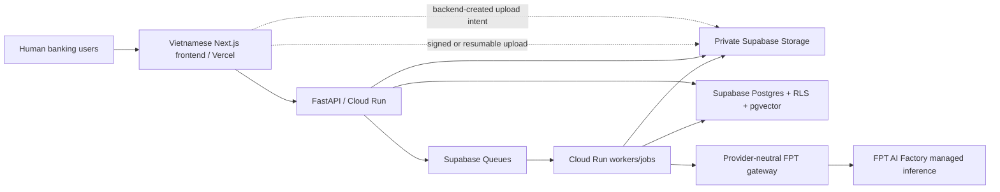

# Solution Description — CreditOpt / SHB CreditOps EvidenceGraph

## 1. Thông tin giải pháp

| Hạng mục | Nội dung |
|---|---|
| Tên giải pháp | CreditOpt — SHB CreditOps EvidenceGraph |
| Lĩnh vực | AI agents cho vận hành tín dụng doanh nghiệp |
| Use case trọng tâm | Chuẩn bị và rà soát hồ sơ vốn lưu động SME/KHDN |
| Đối tượng sử dụng | QHKH/Intake, Underwriting, Legal/Compliance/Collateral, Risk, Credit Operations và cấp có thẩm quyền |
| Kiến trúc | Vercel → Cloud Run → Supabase → FPT AI Factory managed inference |
| Trạng thái | Local walking skeleton; chưa triển khai cloud end-to-end hoặc production-ready |
| Phạm vi dữ liệu | Chỉ dữ liệu synthetic trong development và demonstration |

> All customer data, policies, documents, and banking-system responses in this project are synthetic and created solely for demonstration.

Tài liệu này mô tả giải pháp của project. Quy trình 14 giai đoạn được dùng làm context tín dụng doanh nghiệp tổng quát; đây không phải quy trình hoặc chính sách chính thức của SHB. Nội dung không phải tư vấn hoặc ý kiến pháp lý; pháp chế/người có thẩm quyền phải xác định văn bản áp dụng từ nguồn chính thức còn hiệu lực. Giải pháp không tự động phê duyệt/từ chối tín dụng và không thay thế thẩm quyền của cán bộ ngân hàng.

## 2. Tóm tắt điều hành

CreditOpt là một hệ thống multi-agent có khả năng kiểm chứng, được thiết kế để biến hồ sơ tín dụng doanh nghiệp phân mảnh thành một **Credit Case Digital Twin** có cấu trúc, version và provenance.

Thay vì xây dựng một chatbot có thể trả lời trôi chảy nhưng khó kiểm soát, CreditOpt tách rõ bốn lớp trách nhiệm:

1. **Dữ liệu có thẩm quyền:** Supabase lưu tài liệu, facts đã xác nhận, artifacts, tasks, checkpoints, gates và audit.
2. **Logic xác định:** Cloud Run/FastAPI thực hiện authorization, calculations, rules, dependency, state transition và controlled tools.
3. **Model inference:** FPT AI Factory hỗ trợ trích xuất, phân tích và tạo output có cấu trúc; model không phải source of truth.
4. **Con người chịu trách nhiệm:** cán bộ ngân hàng xác nhận facts, xử lý gaps/challenges, ghi quyết định và cho phép mọi hành động nhạy cảm.

Điểm khác biệt cốt lõi của giải pháp là kết hợp EvidenceGraph, deterministic-tools-first analysis, maker–checker agents, durable workflow và human authority binding. Mỗi kết luận material phải truy ngược được về tài liệu gốc hoặc kết quả công cụ. Mỗi task chạy trên một case version cụ thể. Mỗi human action được gắn với đúng artifact version. Khi evidence thay đổi, hệ thống đánh dấu phần phụ thuộc là stale thay vì âm thầm ghi đè lịch sử.

## 3. Bài toán cần giải quyết

### 3.1 Hồ sơ tín dụng là một hệ thống bằng chứng, không phải một cuộc hội thoại

Một hồ sơ tín dụng KHDN có thể gồm tài liệu pháp lý, báo cáo tài chính, sao kê, hợp đồng mua bán, hóa đơn, phương án sử dụng vốn, tài sản bảo đảm, policy citations và nhiều vòng bổ sung. Các dữ kiện có thể:

- nằm ở nhiều định dạng và nhiều version;
- mâu thuẫn giữa các tài liệu;
- thiếu nguồn hoặc khó đọc;
- thay đổi sau khi thẩm định đã bắt đầu;
- yêu cầu người có thẩm quyền xác nhận;
- ảnh hưởng tới nhiều kết luận downstream.

Lịch sử chat không đủ để quản lý các quan hệ này. Sản phẩm cần một domain model có thể trả lời: dữ kiện đến từ đâu, ai xác nhận, đang áp dụng cho version nào, kết luận nào phụ thuộc vào nó và điều gì phải chạy lại khi evidence thay đổi.

### 3.2 Multi-agent chỉ có giá trị khi trách nhiệm và quyền hạn được mã hóa

Nếu nhiều agent chỉ trao đổi qua hội thoại tự do, hệ thống dễ trở thành “multi-agent theatre”: các agent có tên khác nhau nhưng dùng cùng context, tự xác nhận lẫn nhau và không có ranh giới quyền lực.

CreditOpt yêu cầu mỗi logical agent có:

- goal và output schema riêng;
- evidence scope và tool allowlist riêng;
- task dependency và human gate riêng;
- prohibited actions rõ ràng;
- versioned output và immutable handoff;
- audit và evaluation theo capability.

### 3.3 Tín dụng yêu cầu tính đúng, truy vết và trách nhiệm giải trình

Model ngôn ngữ không phù hợp để tự thực hiện số học material, policy rules, state changes hoặc operational actions. Một câu trả lời nghe hợp lý nhưng sai công thức, sai nguồn hoặc sai version có thể làm giảm chất lượng kiểm soát thay vì cải thiện nó.

CreditOpt vì vậy áp dụng nguyên tắc:

> **LLM đề xuất và diễn giải; deterministic engine tính toán, kiểm tra và quyết định state transition; con người quyết định tín dụng.**

## 4. Mục tiêu giải pháp

CreditOpt hướng tới sáu outcome:

1. Giảm thời gian cán bộ phải tìm và đối chiếu thông tin thủ công.
2. Tăng khả năng truy vết của mọi finding, risk, challenge và memo statement.
3. Phát hiện sớm tài liệu thiếu, facts mâu thuẫn và evidence có độ tin cậy thấp.
4. Chuẩn hóa collaboration giữa maker, specialist, checker và operations.
5. Giữ AI trong ranh giới có thể audit, retry và fail closed.
6. Tạo nền tảng dùng chung xuyên suốt vòng đời tín dụng thay vì tạo các AI tools rời rạc.

Giải pháp không đặt mục tiêu thay thế cán bộ tín dụng hoặc tự động hóa quyết định phê duyệt.

## 5. Người dùng mục tiêu

| Người dùng | Nhu cầu chính | CreditOpt hỗ trợ |
|---|---|---|
| Relationship Manager / Intake Officer | Thu thập nhu cầu, tài liệu và dữ kiện đầu vào | Document-by-document upload, candidate review, conflicts, gaps và handoff |
| Credit Underwriter | Phân tích kinh doanh, tài chính, dòng tiền và cấu trúc | Deterministic calculators, cited findings, scenarios, risks và mitigants |
| Legal/Compliance/Collateral Reviewer | Rà soát tư cách, thẩm quyền, policy và tài sản | Controlled checks, exact policy citations, ownership/collateral gaps |
| Independent Risk Reviewer | Challenge maker analysis một cách độc lập | Deterministic pre-analysis, challenge lifecycle và maker-response trace |
| Credit Operations | Kiểm tra package và chuẩn bị controlled actions | Evidence map, memo draft, conditions và proposed actions |
| Authorized Approver | Xem xét hồ sơ trên đúng version | Neutral human-decision workspace với unresolved items và provenance |
| Monitoring/Collections/Recovery | Theo dõi sau cấp tín dụng | Temporal observations, alerts, repayment ledger và recovery preparation trong target design |
| Auditor/Administrator | Kiểm tra trace và cấu hình được phép | Append-only audit, versioned configuration và capability controls |

## 6. Cách giải pháp hoạt động

### 6.1 Target flow intake theo từng tài liệu

Flow dưới đây mới được triển khai một phần. Upload intent, document-domain foundation và pure processing stages đã có; worker persistence, review/confirmation APIs và intake handoff end-to-end vẫn đang hoàn thiện.

1. Backend tạo upload intent ngắn hạn.
2. Browser upload trực tiếp vào private Supabase Storage.
3. Backend xác minh object và đăng ký immutable `DocumentVersion`.
4. Document worker kiểm tra an toàn, parse, classify, extract và index.
5. Model/deterministic extractor tạo candidate facts kèm page/source region.
6. Assigned Intake Officer disposition từng candidate.
7. Hệ thống tạo confirmed facts, conflicts và evidence gaps.
8. Human-approved intake handoff mở specialist tasks.

Thiết kế này ngăn model tự biến một extraction xác suất thành dữ kiện có thẩm quyền.

### 6.2 Specialist analysis

Underwriting và Legal/Compliance/Collateral có thể chạy song song trên cùng immutable case snapshot:

- deterministic tools chạy trước;
- model chỉ nhận context được cho phép;
- output phải đúng schema;
- citation chỉ được trỏ tới evidence/tool IDs có trong context;
- assumption, uncertainty và missing evidence phải hiển thị rõ;
- schema-invalid hoặc citation-invalid output bị reject hoặc chuyển manual review.

### 6.3 Independent challenge

Independent Risk Review không chỉ tóm tắt maker output. Target design dùng hai pass:

1. Pass độc lập đọc evidence, calculations và gaps để hình thành pre-analysis.
2. Pass so sánh maker/legal artifacts để tạo challenges, omitted risks và mitigant review.

`MAKER_MUST_REVISE` phải tạo maker version mới và checker rerun. Challenge không bị ghi đè; maker response và human disposition được lưu thành records riêng.

### 6.4 Human consideration và operations

Credit Operations tổng hợp evidence map, draft memo và proposed actions. Agent không ghi `HumanCreditDecision` và không thực hiện action.

Human gate phải hiển thị:

- case và artifact version;
- evidence/citations;
- unresolved gaps, conflicts, exceptions và challenges;
- authority requirement;
- consequence của từng lựa chọn;
- rationale và audit reference.

## 7. Quy trình tín dụng 14 giai đoạn

Master design mở rộng Credit Case Digital Twin qua toàn bộ lifecycle:

| # | Giai đoạn | Hỗ trợ của hệ thống | Human owner/gate | Trạng thái |
|---:|---|---|---|---|
| 1 | Tìm kiếm và tiếp cận khách hàng | Prospect record, synthetic screening và contact proposal | RM/QHKH quyết định tiếp cận | Thiết kế mục tiêu |
| 2 | Tiếp nhận và xác định nhu cầu tín dụng | Versioned FinancingRequest và completeness check | Assigned Intake Officer xác nhận nhu cầu | Local foundation |
| 3 | Thu thập và kiểm tra hồ sơ | Upload, extraction, confirmation, conflicts, gaps và handoff | Intake Officer disposition candidates và hoàn tất intake | Đang hoàn thiện end-to-end |
| 4 | Thẩm định khách hàng và đề nghị cấp tín dụng | Underwriting và Legal/Compliance/Collateral song song | Chuyên viên từng lĩnh vực review assessment | Processor foundation đã có |
| 5 | Lập và trình phương án cấp tín dụng | Maker assessment, proposed structure và cited memo sections | Human underwriter xác nhận maker submission | Foundation đã có |
| 6 | Thẩm định độc lập và phê duyệt tín dụng | Risk challenges, package và human decision artifact | Risk disposition; cấp có thẩm quyền ghi quyết định | Risk/Ops có; HumanCreditDecision còn thiếu |
| 7 | Thông báo tín dụng | Draft từ approved terms và communication receipt | Người có thẩm quyền duyệt trước khi gửi | Thiết kế mục tiêu |
| 8 | Đàm phán và ký kết hồ sơ tín dụng | Template, redline, material-change detection và signature evidence | Legal review và người có thẩm quyền ký | Thiết kế mục tiêu |
| 9 | Hoàn thiện biện pháp bảo đảm | Per-asset security-perfection ledger và evidence | Legal/collateral officer xác nhận hoàn tất | Thiết kế mục tiêu |
| 10 | Kiểm tra điều kiện giải ngân | Versioned condition ledger và independent verification | Ops checker độc lập xác nhận từng condition | Thiết kế mục tiêu |
| 11 | Giải ngân vốn vay | Proposed action, dual authorization và mock execution receipt | Validation và authorization tách biệt | Thiết kế mục tiêu; real execution ngoài phạm vi |
| 12 | Quản lý khoản vay và giám sát sau cấp tín dụng | Obligations, observations, covenant tests và alerts | Monitoring officer disposition alerts | Thiết kế mục tiêu |
| 13 | Thu nợ gốc, lãi và phí | Exact-decimal repayment ledger và collections proposals | Người có thẩm quyền duyệt biện pháp/cơ cấu | Thiết kế mục tiêu |
| 14 | Tất toán hoặc xử lý nợ | Settlement check hoặc recovery evidence pack | Authorized humans duyệt settlement/recovery/legal action | Thiết kế mục tiêu; enforcement ngoài phạm vi |

## 8. Đội ngũ tám logical agents

| Agent | Goal | Không được phép |
|---|---|---|
| Case Orchestrator | Điều phối task, dependency, invalidation và human gates | Phân tích chuyên môn hoặc quyết định tín dụng |
| Relationship & Intake | Chuẩn hóa nhu cầu, tài liệu, facts và gaps | Bịa dữ liệu hoặc tự gửi request khách hàng |
| Credit Underwriting | Maker analysis và proposed structure | Approve/reject hoặc dùng LLM thay calculator |
| Legal, Compliance & Collateral | Review pháp lý, policy, controlled checks và collateral evidence | Legal conclusion cuối cùng hoặc LLM valuation |
| Independent Risk Review | Challenge maker assumptions, findings và mitigants | Làm maker hoặc tự clear challenge |
| Credit Operations | Assemble package, memo và proposed actions | Credit decision hoặc sensitive execution |
| Post-Credit Monitoring | Theo dõi obligations, observations và alerts | Official debt classification hoặc autonomous control |
| Collections & Recovery | Hỗ trợ reconciliation, settlement và recovery preparation | Tự contact, restructure, enforce hoặc write off |

Tám roles là application responsibilities, không bắt buộc tám model hay tám service. Evidence Gap Resolution là workflow capability dùng chung, không phải agent thứ chín.

## 9. Các điểm đổi mới chính

### 9.1 Credit Case Digital Twin có provenance

Thay vì lưu một memo cuối cùng, hệ thống giữ facts, evidence, calculations, findings, risks, challenges, decisions và receipts thành records có version. Điều này cho phép replay, audit và targeted rerun.

**Giá trị đo lường:** tỷ lệ material claims resolve được về evidence/tool; completeness của lineage; stale-write rate.

### 9.2 EvidenceGraph với human-confirmed fact promotion

Mỗi candidate fact phải trỏ về document version và source region. Human disposition là điều kiện để promotion thành confirmed fact. Conflicts và gaps là first-class objects, không bị chôn trong narrative.

**Giá trị đo lường:** confirmation accuracy, conflict/gap detection precision-recall, cross-case leakage và citation resolution.

### 9.3 Deterministic orchestration bao quanh LLM planner

Planner không thể tự tạo task type, vượt dependency hoặc thỏa human gate. Deterministic graph tính readiness và validation. Đây là khác biệt giữa “AI lập kế hoạch” và “AI sở hữu workflow”.

**Giá trị đo lường:** gate-bypass attempts accepted, invalid-plan rejection, deterministic readiness consistency và stale transitions.

### 9.4 Deterministic-tools-first maker analysis

Financial ratios, working-capital need và scenarios được tính bằng code với exact decimal. Model diễn giải output đã tính thay vì tự làm số học.

**Giá trị đo lường:** calculation exactness, schema validity, unsupported statement rate và replay consistency.

### 9.5 Maker–checker được mã hóa

Independent Risk Review có context, output và execution riêng. Same-execution guard cùng immutable versioning bảo vệ separation of duties ở cấp hệ thống, không chỉ ở prompt.

**Giá trị đo lường:** maker/checker identity violations, challenge coverage, unresolved challenge visibility và revision-loop correctness.

### 9.6 Graph-guided hybrid RAG từ graph về tài liệu gốc

Target retrieval flow không vector-search toàn corpus ngay từ đầu. Typed graph thu hẹp case/version/entity/edge; lexical/vector retrieval tìm passages trong phạm vi đó; source hydrator lấy lại đoạn từ immutable original; citation validator kiểm tra output.

**Giá trị đo lường:** Recall@k, citation precision, stale/cross-case hit rate, token/latency/cost so với vector-only baseline.

### 9.7 Reasoning inheritance không lưu chain-of-thought

Agent sau kế thừa structured claims, calculations, evidence, assumptions, challenges và dispositions. Hidden chain-of-thought không được lưu hoặc hiển thị.

**Giá trị đo lường:** artifact lineage completeness, context token reduction, reproducibility và absence of raw reasoning fields.

**Trạng thái:** target design; typed assessments/challenges đã có nhưng `ContextManifest` và reasoning graph chưa được triển khai.

### 9.8 Durable agent execution

Task có stable ID, idempotency, lease, checkpoint và case-version fence. Duplicate delivery là expected behavior; hệ thống phải neutralize duplicate effects.

**Giá trị đo lường:** recovery success, duplicate effects, checkpoint-resume correctness và stale-write success.

**Trạng thái:** task/lease/checkpoint/version-fence primitives đã có; worker composition và transactional outbox/inbox đang hoàn thiện.

### 9.9 Human authority binding

Human action không chỉ là một nút bấm. Record phải chứa actor, role/authority, exact artifact version, disposition, rationale và audit reference. Proposed action không đồng nghĩa executed action.

**Giá trị đo lường:** unauthorized mutation, gate bypass, version-conflict handling và action-reconciliation correctness.

**Trạng thái:** risk dispositions và proposed-action authorization records đã có; `HumanCreditDecision`, dual authorization và action execution/reconciliation là target design.

### 9.10 Capability-based model governance

Reasoning, vision, KIE, table và embedding là các capability routes riêng. Model/endpoint/prompt/schema versions phải được ghi nhận và benchmark trước activation. Hệ thống không fallback âm thầm sang provider/model khác.

**Giá trị đo lường:** benchmark score theo capability, invalid-output rate, grounding, latency, cost và route-drift detection.

## 10. Kiến trúc giải pháp



### 10.1 Vercel/frontend

- Giao diện tiếng Việt theo role/task.
- Same-origin BFF, CSRF và route/method allowlist.
- Không giữ workflow authority.
- Không gọi FPT trực tiếp.
- Không proxy document bytes qua Vercel Functions.

### 10.2 Cloud Run/FastAPI

- Authentication/authorization và API contracts.
- Deterministic state machine, calculators và tools.
- Context building, model gateway và output validation.
- Worker orchestration/checkpoint và authorization-record control; proposed-action execution path là thiết kế mục tiêu.

### 10.3 Supabase

- Credit Case Digital Twin và EvidenceGraph.
- Postgres/RLS, task state, checkpoints và audit.
- Durable queues và private object storage.
- pgvector retrieval foundation.

### 10.4 FPT AI Factory

- Chỉ chạy managed inference.
- Không có database credentials hoặc quyền operational action.
- Capability routing explicit; thiếu config hoặc benchmark-pass record thì fail closed.
- Candidate stack hiện tại gồm DeepSeek-V4-Flash cho reasoning, Qwen2.5-VL-72B-Instruct cho vision và multilingual-e5-large cho embedding; KIE/table chưa pin. Benchmark registry đang rỗng nên mọi FPT route bị disable.

## 11. Shared memory, RAG và token efficiency

### 11.1 Bảy lớp memory

Đây là target memory architecture. Repository hiện có case/evidence/analytical/workflow foundations; longitudinal memory và full policy/context contracts chưa được triển khai.

1. Procedural memory: prompts, tools, schemas và workflow rules.
2. Authoritative case memory: confirmed facts, human decisions và receipts.
3. Evidence memory: documents, versions, regions và passages.
4. Analytical memory: calculations, assessments, risks và challenges.
5. Workflow memory: tasks, dependencies, gates và checkpoints.
6. Longitudinal memory: facilities, obligations, alerts và payments.
7. Policy memory: approved/versioned corpus tách khỏi customer evidence.

### 11.2 Context tối thiểu theo task

Target `ContextManifest` chỉ chứa refs được phép, exact versions, upstream artifacts, unresolved items, tool results, retrieval hits, exclusions và token budget. Cách này giảm token so với đưa toàn bộ case/chat vào mỗi request và giảm nguy cơ agent dùng stale hoặc unauthorized context.

### 11.3 Trình tự token-efficient

```text
SQL/typed filters
  -> deterministic calculations/rules
  -> bounded graph traversal
  -> lexical/vector retrieval
  -> optional benchmark-approved reranking
  -> minimum-context model inference
```

## 12. Responsible AI và human governance

### 12.1 Human-only decisions

AI không được:

- approve/reject credit;
- waive policy/condition hoặc approve exception;
- đưa legal determination cuối cùng;
- ký hợp đồng;
- release funds;
- restructure debt;
- release/enforce security;
- mutate sensitive banking systems.

### 12.2 Evidence và uncertainty

- Material claim phải có citation hoặc deterministic tool reference.
- Unsupported proposition phải là assumption, uncertainty hoặc gap.
- Model output không hợp lệ bị reject/manual review.
- Evidence mới không xóa lịch sử; nó làm artifacts phụ thuộc trở thành stale.

### 12.3 Data protection

- Chỉ dữ liệu synthetic được phép trong repository hiện tại.
- Browser upload qua short-lived intent vào private storage.
- RLS và backend authorization áp dụng theo case/assignment.
- Document text luôn là untrusted input.
- Secrets, signed URLs, raw documents và hidden reasoning không được ghi log.

### 12.4 Fairness và human contestability

- Giải pháp hiện không chấm điểm hoặc xếp hạng creditworthiness.
- Không suy luận hoặc sử dụng thuộc tính nhạy cảm không cần thiết.
- Model output không được xem là adverse-action reason hoặc quyết định tín dụng.
- Mọi triển khai tương lai với dữ liệu thật phải có fairness/disparate-impact evaluation, representative test sets, human contestability, outcome monitoring và governance approval.

## 13. Trạng thái triển khai

### 13.1 Đã có trong repository

- Next.js Vietnamese workspaces cho stages 2–6.
- FastAPI case/upload/task/orchestration/specialist endpoints nền tảng.
- Supabase migrations cho cases, evidence, gaps, tasks, gates, assessments, RLS và audit.
- Pure document-processing stages và provider-neutral FPT gateway.
- Orchestrator, Underwriting, Legal, Risk và Credit Operations processors.
- Deterministic calculators và synthetic policy/citation validation.
- Same-origin BFF và security controls.
- Backend/frontend tests, Docker, CI/CD contracts và Terraform foundation.

### 13.2 Các blocker P0

1. Worker composition root chưa được wire end-to-end.
2. Document persistence/review/confirmation APIs chưa kín.
3. Intake completion/handoff path còn thiếu.
4. G2 gap-request approval có circular dependency với Credit Operations.
5. Auto orchestration tick và transactional outbox/inbox còn thiếu.
6. Maker revision loop chưa đầy đủ.
7. Multi-role assignments và HumanCreditDecision chưa có.
8. `GoalContract`, `ContextManifest` và targeted invalidation chưa có runtime.
9. Benchmark activation gate đã được triển khai; chưa có committed benchmark-pass evidence hoặc live FPT evaluation nên mọi route vẫn disabled.
10. Chưa có live FPT/Supabase/Cloud Run/Vercel verification.

### 13.3 Chưa có nguồn chính thức

- SHB workflow/checklist/policy corpus.
- Delegation-of-authority/RACI.
- SLA và materiality thresholds.
- Credit memo/notification/contract templates.
- API sandbox cho core systems.
- Production-data authorization.

## 14. Giá trị kỳ vọng và cách đo lường

Không sử dụng các con số tiết kiệm chưa được benchmark. Giá trị của giải pháp sẽ được chứng minh bằng before/after evaluation trên synthetic cases có ground truth.

| Giá trị | Metric đề xuất |
|---|---|
| Tăng tốc intake | Thời gian từ upload đến package sẵn sàng review; thời gian disposition mỗi document |
| Giảm bỏ sót | Gap/conflict precision, recall và F1 |
| Tăng chất lượng bằng chứng | Citation precision; material-claim grounding rate |
| Tăng độ đúng tính toán | Deterministic calculation exactness |
| Cải thiện independent review | Challenge coverage; omitted-risk detection |
| Giảm công việc lặp lại | Số bước thủ công/case; số section được prefilled có nguồn |
| Tăng khả năng phục hồi | Retry-resume success; duplicate-effect rate; stale-write rate |
| Tăng kiểm soát | Wrong-role mutation, gate bypass và cross-case leakage |
| Tối ưu inference | Tokens, latency, model calls và cost per document/case |
| Tăng auditability | Tỷ lệ artifacts truy vết đủ actor/version/evidence |

## 15. Evaluation framework

### 15.1 Synthetic scenarios

- Hồ sơ đầy đủ.
- Thiếu evidence theo synthetic checklist.
- Facts mâu thuẫn.
- Scan không đọc được hoặc table nhiều trang.
- Potential synthetic policy exception.
- Maker/checker disagreement và revision loop.
- Evidence mới làm stale selected outputs.
- Unauthorized/cross-case access attempt.
- FPT timeout hoặc malformed output.
- Duplicate queue delivery và action timeout.
- Monitoring alert, partial payment, reversal, settlement và recovery branches.

### 15.2 Model evaluation

Mỗi benchmark run cần bind:

- capability;
- endpoint/model version;
- prompt/schema/route version;
- dataset/manifest version;
- grounding và provenance results;
- structured-output validity;
- abstention behavior;
- latency, throughput và cost.

Model có unsupported material fact, fabricated/missing provenance hoặc invalid schema phải bị loại dù các metric khác tốt.

### 15.3 System acceptance

- Cross-case leakage: `0`.
- Unauthorized mutation: `0`.
- Human-gate bypass: `0`.
- Stale-write success: `0`.
- Unconfirmed fact promotion: `0`.
- Agent-created credit decision: `0`.
- Blind retry sau ambiguous external effect: `0`.
- Hidden fallback: `0`.
- Stored chain-of-thought: `0`.

Các ngưỡng quality/latency/cost còn lại phải được project team phê duyệt trước khi đưa ra readiness claim.

## 16. Roadmap thực thi

Foundation vừa hoàn thành gồm đồng bộ truth/status và role vocabulary, thống nhất canonical synthetic-data notice, đồng thời thêm benchmark-pass gate để mọi FPT route fail closed khi chưa có evaluation evidence được commit.

| Wave | Outcome |
|---:|---|
| 1 | Worker composition, outbox/events, auto orchestration, assignments và audit |
| 2 | Khép kín stages 1–3: prospect, need, document review, gaps và handoff |
| 3 | Khép kín stages 4–6: specialist review, risk loop, package và HumanCreditDecision |
| 4 | Synthetic workflows cho stages 7–10 |
| 5 | Human-authorized mock disbursement cho stage 11 |
| 6 | Temporal monitoring cho stage 12 |
| 7 | Repayment, collections, settlement và recovery preparation cho stages 13–14 |
| 8 | Security, evaluation, performance, backup/restore và deployment evidence |

Mỗi wave phải có tests, versioned contracts, rollback/recovery semantics và human review checkpoint. Việc hoàn thành local code không tự động cho phép dùng real data hoặc production integration.

## 17. Rủi ro và biện pháp kiểm soát

| Rủi ro | Kiểm soát | Trạng thái |
|---|---|---|
| Hallucinated facts | Candidate/confirmed separation, citation allowlist và schema validation | Foundation đã có; confirmation API đang hoàn thiện |
| Sai số học | Deterministic calculators với exact decimal | Đã có |
| Sai policy | Versioned synthetic corpus, exact citations và abstention | Đã có cho local synthetic review |
| Prompt injection | Trusted/untrusted context separation và backend validation | Đã có foundation/tests |
| Agent vượt quyền | Role checks, human gates và proposed-action pattern | Một phần; authority model đầy đủ còn thiếu |
| Maker tự kiểm tra | Independent execution, same-execution guard và immutable versions | Đã có foundation |
| Retry tạo duplicate | Idempotency, lease và checkpoint; target outbox/inbox | Một phần |
| Dùng stale evidence | Case-version fence; target dependency invalidation | Một phần |
| Cross-case leakage | RLS, case-assignment checks và retrieval filters | Foundation đã có; tenant contract chưa có |
| Model/provider drift | Pinned capability route và committed benchmark-pass gate | Gate đã có; registry rỗng |
| External action không rõ kết quả | Target `EXECUTION_UNKNOWN`, no blind retry và human reconciliation | Chưa triển khai action path |

## 18. Khả năng mở rộng

Kiến trúc tách application contracts khỏi model provider và external systems. Điều này cho phép:

- thay model theo capability mà không thay workflow authority;
- bổ sung document family và extraction schema có version;
- thêm policy corpus theo access/effective-date rules;
- mở rộng agent role nhưng vẫn dùng chung task/handoff/audit protocol;
- kết nối mock adapter trước, production adapter sau governance review;
- scale API, document workers, agent workers và action workers độc lập;
- mở rộng từ case-level EvidenceGraph sang portfolio analytics mà không dùng global GraphRAG cho decision support mặc định.

## 19. Kết luận

CreditOpt không cố gắng biến AI thành người phê duyệt tín dụng. Giải pháp biến AI thành một đội ngũ chuyên gia hỗ trợ có giới hạn, làm việc trên cùng Credit Case Digital Twin, kế thừa kết quả qua artifacts có cấu trúc và luôn để lại evidence trail.

Innovation quan trọng nhất không nằm ở số lượng agent, mà ở control architecture bao quanh chúng:

- facts phải được human-confirmed;
- calculations và rules phải deterministic;
- maker và checker phải độc lập;
- graph phải dẫn về tài liệu gốc;
- model calls phải có context/version provenance;
- decisions và sensitive actions phải thuộc về con người;
- mọi retry, change và handoff phải audit được.

Đây là nền tảng để xây một hệ thống AI hỗ trợ credit operations vừa hữu ích, vừa có thể kiểm chứng và mở rộng an toàn khi các nguồn chính thức, benchmark và quyền tích hợp được cung cấp.

## 20. Tài liệu tham chiếu trong repository

- [README](../README.md)
- [Master Workflow Design](superpowers/specs/2026-07-18-full-credit-lifecycle-agent-workflow-design.md)
- [Project Context](PROJECT_CONTEXT.md)
- [Agent Architecture](AGENT_ARCHITECTURE.md)
- [Technical Direction](TECHNICAL_DIRECTION.md)
- [Decision Log](DECISION_LOG.md)
- [Open Questions](OPEN_QUESTIONS.md)
- [Deployment Runbook](DEPLOYMENT_RUNBOOK.md)
